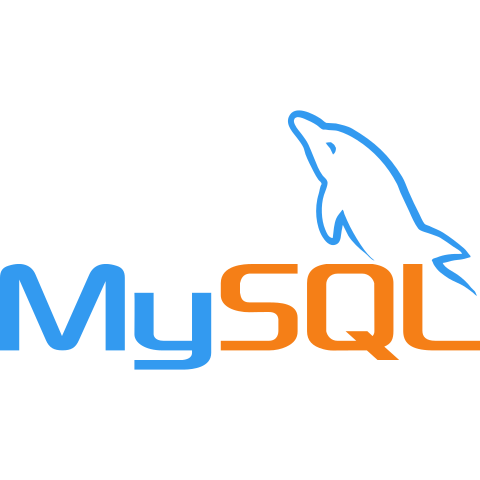
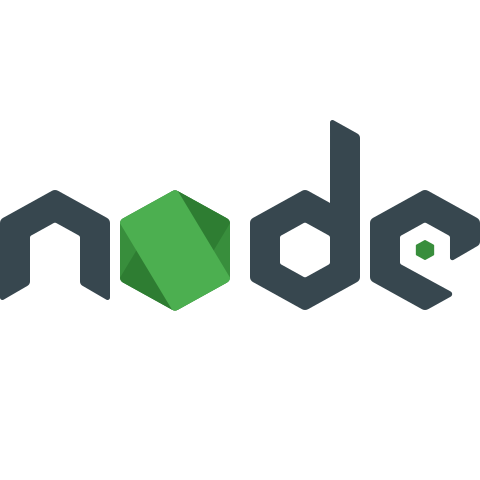
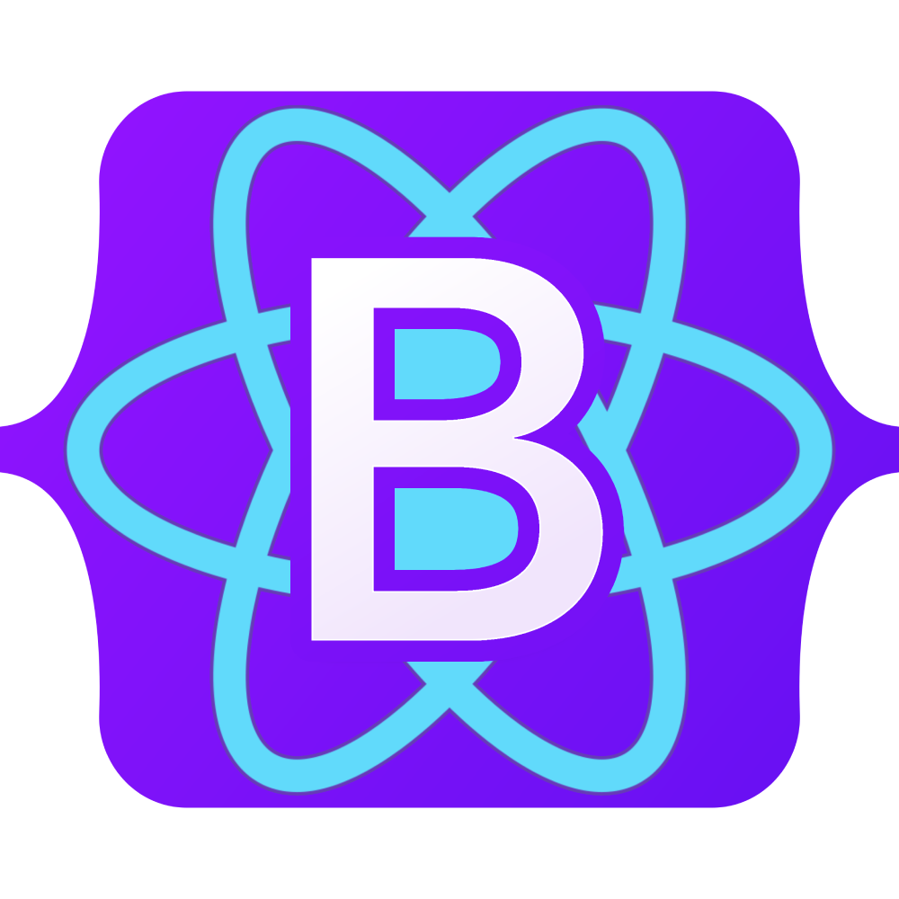

<h2><b>👋 Hi, I’m Oleksandr Mustakaiev</b></h2>

 

<h3><b>Languages I have used:</b></h3>

 

<h3><b>Some of the technologies I have worked with:</b></h3>

<!---
OleksandrMustakaiev/OleksandrMustakaiev is a ✨ special ✨ repository because its `README.md` (this file) appears on your GitHub profile.
You can click the Preview link to take a look at your changes.
--->
